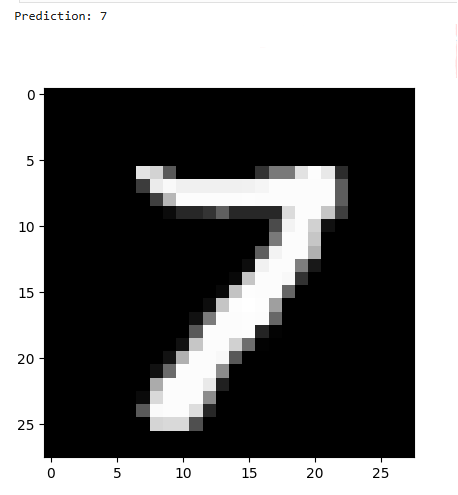

# Project4_Handwritten_Digit_Recognition
Classifying handwritten digits into 0, 1, 2, 3...9 using Pytorch 

## DATASET
MNIST dataset contains 70k graysacale images of handwritten digits (0-9) each sized 28x28 pixels. 60k images are used for training and 10k images are used for testing. Load the MNIST dataset and transform data to tensor. Very clean dataset, no data preprocessing required. Create data loaders to load training and testing data in batch sizes of 100 and shuffled. 

## MODEL TRAINING: DEFINE CONVOLUTIONAL NEURAL NETWORKS
Define 2 d convolutional layers since we're working with images. Convolutional layer > ReLU as activation > Max pooling. Then repeat and finally flatten for NN. Create fully connected layer > ReLU activation function > Use dropout for regularization - to drop out 50 percent of neurons for better generalization > another fcl which outputs ten neurons (0,1,2,3,4,5,6,7,8,9).

Define loss function as cross entropy loss and optimizer as Adam to optimize model parameters. Start model training: for each epoch, for features and target in training set, reset the gradients to 0, get model output for given input, calculate loss using cross entropy loss, backpropagate loss, take a step with optimizer in right direction.

## MODEL EVALUATION
Evaluate model on unseen data. Disable gradient calculation because we're not doing training. Get predictions for test set, calculate the max arg from the predictions to find highest activation and find accuracy.
